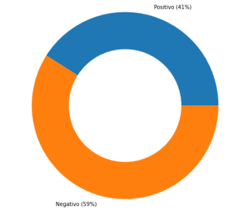
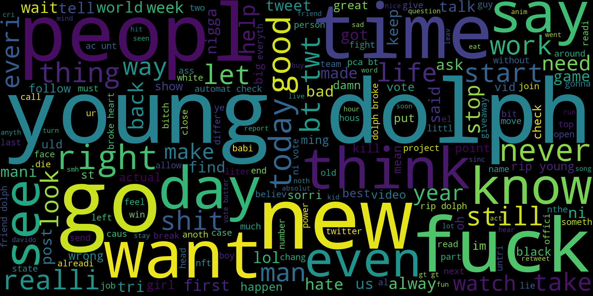

# Twitter-negativity
Project using sentiment analysis to understand twitter's behavior

## Resume

The present work aims to analyze tweets in English, using a model of
sentiment analysis, to see if, in fact, as common sense tells us, twitter
is a social network with negative trends, which becomes a worrying fact, since
exposing yourself to environments with this load can affect users' mood. To train the
CatBoost classification model, used in the sentiment analysis task, we use
data obtained through the dataset Emotions dataset for NLP from the kaggle website and, with the
trained model, we obtained data from twitter through the Twarc tool. we had as
conclusion that, in fact, twitter, in the American context, is a more negative social network,
with rates of 44.62% higher than positivity.

## Results

     
    Distribution of positive and negative expressions

 

     
    Wordcloud for negative text

 

     
    Wordcloud for positive text

